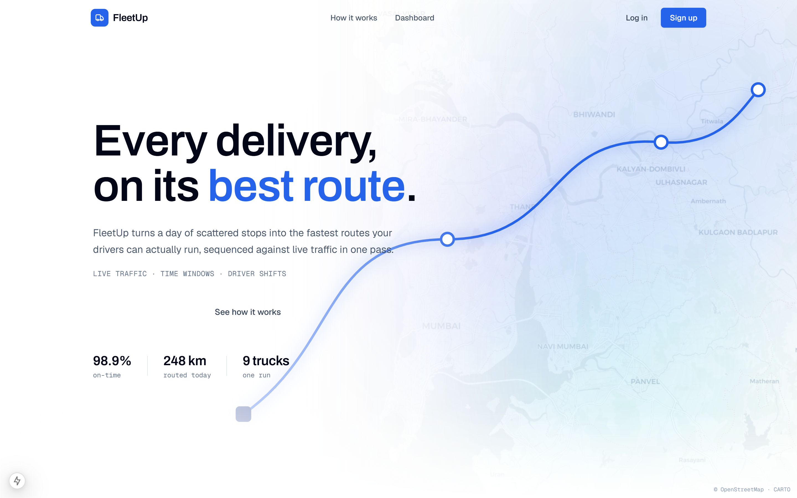
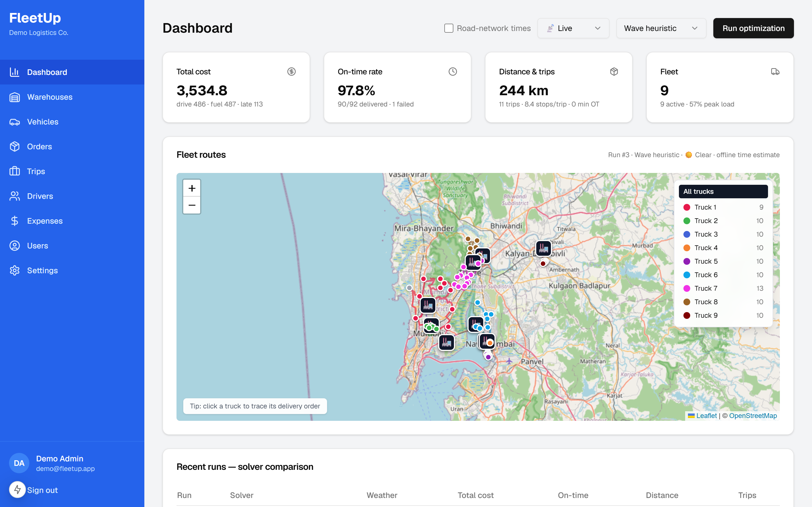
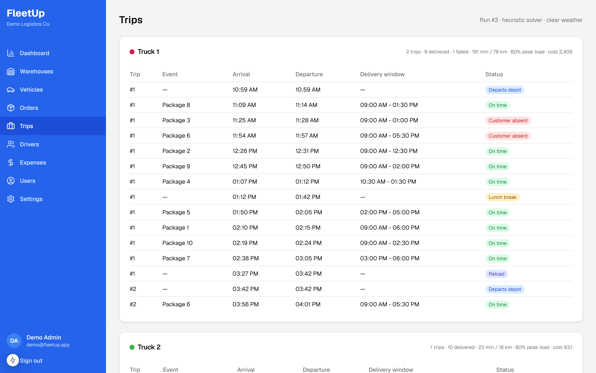
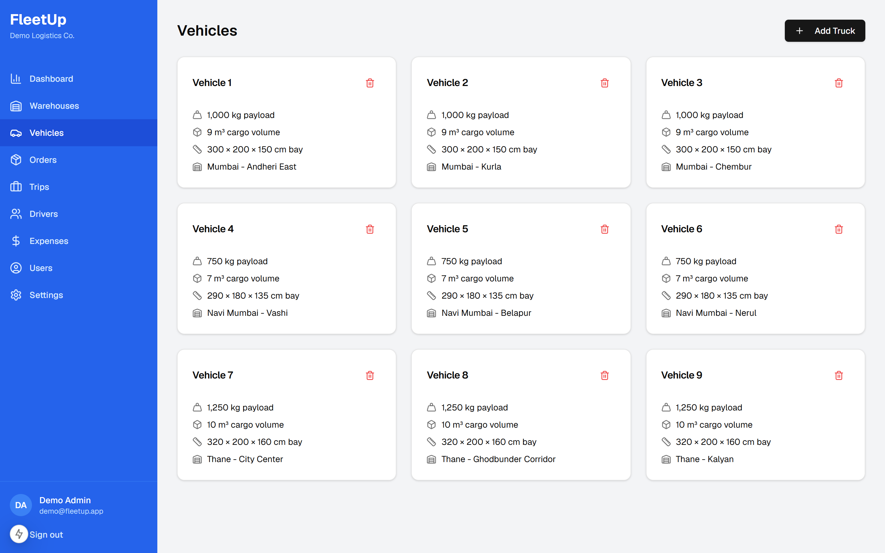
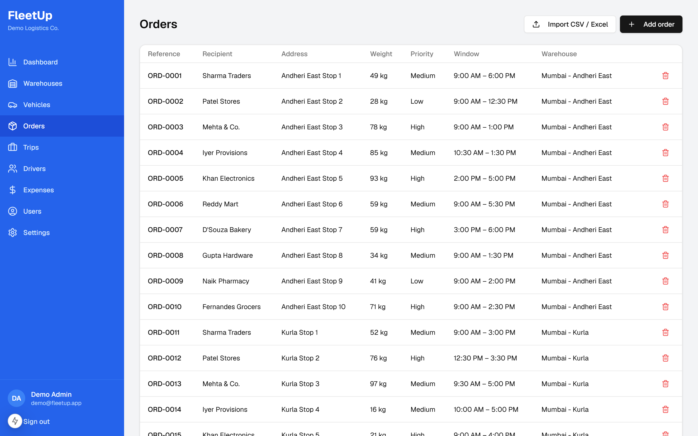

# FleetUp

**Traffic-aware, multi-trip fleet route optimization.**

FleetUp decides which truck should deliver which orders, in what sequence, and at what time of day, so that a full day of deliveries gets done on time at the lowest total cost. It models the messy realities most routing demos skip: driver shifts and lunch breaks, trucks that drive back to the depot to reload, traffic that gets worse at rush hour, weather that slows everything down, and customers who are not home when the driver knocks.

It is a full-stack application, but the heart of the project is the optimization engine. The same fleet and the same orders can be solved three different ways (a hand-built routing solver, a reinforcement-learning agent, and a graph neural network), and every result is scored against one shared definition of what a good plan is, so the approaches can be compared fairly.

## Table of contents

1. [What it does](#what-it-does)
2. [The one number everything optimizes](#the-one-number-everything-optimizes)
3. [The machine-learning parts explained](#the-machine-learning-parts-explained)
4. [How one optimization run flows](#how-one-optimization-run-flows)
5. [Screens and what they show](#screens-and-what-they-show)
6. [Run it yourself](#run-it-yourself)
7. [Command-line usage](#command-line-usage)
8. [Configuration](#configuration)
9. [Accounts and your own data](#accounts-and-your-own-data)
10. [Importing orders from a spreadsheet](#importing-orders-from-a-spreadsheet)
11. [Metrics the dashboard tracks](#metrics-the-dashboard-tracks)

## What it does

Imagine a delivery company with several depots (warehouses), a set of trucks, and a long list of parcels to deliver today. Each parcel has a weight, a size, a priority, and often a delivery window (for example, "between 2pm and 6pm"). Every truck has a driver who works a normal shift, needs a lunch break, and can only carry so much at once.

The company needs answers to a chain of questions:

1. Which warehouse should each parcel ship from?
2. Which truck should carry each parcel?
3. If a truck cannot carry everything in one go, how should its load be split across multiple trips (with a reload stop back at the depot in between)?
4. In what order should each truck visit its stops so that nobody is late and the truck drives as little as possible?
5. What time should each trip leave, given that traffic and delivery windows both matter?

FleetUp answers all of these automatically, then simulates the day minute by minute (including the lunch break, reloads, a few failed deliveries, and any overtime) and reports what the plan actually costs. The result is drawn on a live map, one colored route per truck, with a full schedule for every stop.

## The one number everything optimizes

Before we say one plan is "better" than another, we have to define "better." FleetUp does this once, in a single cost formula. Every planner is judged by this number, and the dashboard shows exactly how the number breaks down.

```
total cost =  driving minutes                        x 1     (time on the road)
            + distance in km                         x 2     (fuel and vehicle wear)
            + number of depot departures             x 30    (each trip has a fixed cost)
            + waiting minutes                         x 0.2   (idling is cheap, but not free)
            + minutes late, scaled by priority        x 3     (soft delivery windows)
            + overtime minutes past the shift end     x 5     (keeping a driver late is expensive)
            + undelivered parcels, scaled by priority x 500   (failing a delivery is the worst outcome)
```

A few things fall out of this design naturally:

- **Pointless trips get punished.** Because every departure from the depot costs a flat 30, a truck will not make a second trip unless it truly has to (for example, because its load did not fit in one go).
- **Priority matters more than distance.** A late or failed delivery for a high-priority parcel is multiplied (priority levels cost 1x, 2x, or 4x), so the planner protects important orders first.
- **Windows are soft, not hard.** Being a little late costs money rather than being forbidden, which keeps the problem solvable even when the day is tight, and lets the planner make sensible trade-offs.

Because this one formula defines success, the hand-built solver, the reinforcement-learning agent, and the final scoreboard all speak the same language. That is what makes comparing them meaningful.

## The machine-learning parts explained

This is the technical core of the project. There are four distinct techniques.

### 1. Clustering: grouping stops before assigning trucks

Before deciding which truck takes which parcel, FleetUp groups parcels that are physically close together. It uses a density-based method (DBSCAN) that finds natural clumps of stops, and falls back to a simpler method (K-Means) when needed. Keeping a cluster of nearby stops on the same truck means less back-and-forth driving. Assignment then respects three limits at once: a truck's weight capacity, its volume capacity, and whether a parcel physically fits in the cargo bay (checked by trying every rotation of the box).

### 2. The routing solver: the main brain

This is the primary planner and it is a classic operations-research approach done carefully:

- **Build a first draft (cheapest insertion).** Start with one stop, then repeatedly insert the next stop in the position that adds the least cost.
- **Improve the draft with local search.** Two well-known moves are applied until neither one helps any more:
  - one move reverses a stretch of the route to untangle a path that crosses over itself,
  - the other lifts a short run of one to three stops and reinserts it elsewhere, which rescues a stop that is physically on the way but ended up stranded out of order.
- **Choose the departure time.** This is a subtle and important step. Each trip leaves as late as it usefully can without making anyone late. That is how the planner learns to "wait for the afternoon window": if two nearby stops both open at 2pm and 4pm, it batches them into one late-afternoon trip instead of leaving in the morning and idling for hours.
- **Move stops between trips.** After sequencing, it tries shifting a stop from one trip to a neighbouring trip, because sometimes that saves distance now and fits windows better later.

Every candidate is scored with the shared cost formula, so the solver is optimizing exactly the number the dashboard reports.

### 3. The reinforcement-learning agent (DQN)

The second planner learns to sequence stops by trial and error.

The training environment is set up like a simple game. At each step, the agent looks at which stops are still waiting to be delivered on the current trip, plus how far into the day it is, and it picks the next stop to visit. Its "reward" is the negative of the cost that choice adds. Because the reward is the same cost formula the hand-built solver minimizes, the agent is literally being trained to chase the same goal, which is what makes the comparison fair.

The agent is a Deep Q-Network (built with Stable-Baselines3 and PyTorch). After training for a few thousand practice steps, it plays greedily: at each stop it picks the deliverable stop with the highest predicted value.

### 4. The graph neural network (GNN)

The map of stops is naturally a graph: stops are points, and the travel times between them are the connections. A two-layer graph convolutional network reads each stop's location and the travel-time graph and produces a suggested visit order, which is recorded alongside each run.

### The shared simulator

No matter which planner produced the sequence, the plan is played out by one shared simulator. It walks the day minute by minute and inserts everything real: waiting when the truck arrives before a window opens, the driver's lunch break, reload stops between trips, randomly failed deliveries (a customer is not home), one economically justified retry attempt for those failures, and any overtime. Because every planner is judged by the same simulator, none of them can look good by ignoring reality.

Runs are **reproducible**: the same inputs, weather, and random seed always produce the same result, including which deliveries fail.

## How one optimization run flows

```
orders
  -> assign each order to a warehouse (honor an explicit choice, else nearest)
  -> cluster nearby orders, assign them to that warehouse's trucks (respecting weight, volume, size)
  for each truck:
      -> split its load into reload trips (waves) only if one load cannot carry it all
      -> sequence the stops on each trip        (classic solver  OR  learned agent)
      -> pick each trip's departure time         (leave as late as is useful)
      -> re-price against traffic at that hour, then re-plan
      -> simulate the day: waiting, lunch, reloads, failures + retry, overtime
  -> add up fleet-wide metrics and the cost breakdown
  -> draw real road-following routes on the map
  -> save everything, serve it to the dashboard
```

Travel times are **time-of-day aware**. Each trip's travel times are recomputed for the hour it actually departs, so a morning trip is priced with morning traffic and an afternoon trip with afternoon traffic. Weather scales all of it (clear is normal, rain is about 1.35x slower, storm is about 1.7x slower).

## Screens and what they show

**Landing page.** The public front of the product.



**Dashboard.** The headline metrics for the latest run (total cost, on-time rate, distance and trips, fleet size), and every truck's route drawn on the map with color-coded stops and depot markers. The controls at the top let you pick the weather and the planner, then run a fresh optimization. The table below the map compares recent runs.



**Trips.** The per-truck schedule: each trip, its stops in order, arrival and departure times, delivery windows, and on-time status.



**Vehicles.** Manage the fleet: each truck's payload capacity, cargo volume, home warehouse, and optional internal bay dimensions (used to reject a parcel that physically cannot fit).



**Orders.** Manage delivery orders: address, weight, size, priority, delivery window, and an optional source warehouse. Orders can be entered by hand or imported from a spreadsheet.



## Run it yourself

### What you need first

- **Python 3.12 or newer.** Check with `python --version`.
- **Node.js 18 or newer.** Check with `node --version`.

### Step 1: Get the code

```bash
git clone <> fleetup
cd fleetup
```

### Step 2: Start the backend

Open a terminal in the project folder and run these commands one by one.

```bash
cd backend

# create a private, isolated Python environment for this project
python -m venv .venv

# turn the environment on
#   Windows (PowerShell):
.venv\Scripts\Activate.ps1
#   Windows (Git Bash):
source .venv/Scripts/activate
#   macOS / Linux:
source .venv/bin/activate

# install everything the backend needs
pip install -r requirements.txt

# start the server
uvicorn app.main:app --port 8010
```

The first time it starts, the backend automatically creates its database and fills it with a demo company (a sample fleet and one finished route plan). When you see a line that says the server is running on `http://127.0.0.1:8010`, leave this terminal open. You can visit `http://localhost:8010/docs` in a browser to see the full API.

### Step 3: Start the frontend

Open a **second** terminal (leave the backend running in the first one).

```bash
cd frontend

# install the frontend packages
npm install

# start the dashboard
npm run dev
```

When it finishes, it will print a local address, usually `http://localhost:3000`.

### Step 4: Open the app and log in

Open **`http://localhost:3000`** in your browser.

Click through to the dashboard and log in with the demo account:

- **Email:** `demo@fleetup.app`
- **Password:** `Fleet@Demo2026`

The demo account already has warehouses, a fleet, orders, and one completed optimization, so the map is populated the moment you log in.

### Step 5: Run an optimization

On the dashboard, use the controls at the top right:

1. Pick a **weather** condition (or leave it on live weather).
2. Pick a **planner** (the wave heuristic is fast; the learning agent takes longer because it trains a model per truck).
3. Click **Run optimization.**

The wave heuristic finishes in about a second. When it is done, the map redraws with the new routes and the metrics update. The "recent runs" table lets you compare different weather and planner choices on total cost.

## Command-line usage

You can run the entire engine from the terminal without the web app at all. This is the fastest way to experiment with the optimization itself.

```bash
cd backend
python scripts/run_pipeline.py [--solver heuristic|dqn] [--weather live|clear|rain|storm]
                               [--online] [--straight] [--failure-rate 0.05] [--seed N] [--gnn]
```

- `--solver` chooses the classic solver or the learning agent.
- `--weather live` pulls current conditions from a free weather service; `clear`, `rain`, and `storm` force a condition.
- `--online` uses real road-network travel times instead of the built-in estimate.
- `--straight` skips road-shape drawing (fastest, fully offline).
- `--gnn` also trains the graph network (slower; its suggestion is recorded).

It writes `outputs/routes.csv` (every stop, arrival, departure, and on-time flag) and `outputs/kpis.json` (the full metric breakdown), and prints the cost breakdown to the screen.

## Configuration

Everything runs with sensible defaults. To customize, copy `backend/.env.example` to `backend/.env` and fill in only what you need.

| Setting             | Default                 | What it does                                                                                                                                  |
| ------------------- | ----------------------- | --------------------------------------------------------------------------------------------------------------------------------------------- |
| `OSRM_BASE_URL`     | public demo server      | Where road shapes and optional road-network travel times come from (free, no key). Point it at your own server for production.                |
| `TOMTOM_API_KEY`    | empty                   | If set, road shapes and live-traffic travel times come from TomTom instead of the free source.                                                |
| `GEOCODER_BASE_URL` | OpenStreetMap Nominatim | Turns typed addresses into map coordinates during order import (free). Results are cached and requests are throttled to the service's policy. |
| `DATABASE_URL`      | local SQLite file       | Where data is stored.                                                                                                                         |
| `JWT_SECRET`        | empty                   | Signs login sessions. Set a strong value in production. If empty, a random one is used per run (so sessions reset when the server restarts).  |
| `JWT_EXPIRE_HOURS`  | 168 (7 days)            | How long a login stays valid.                                                                                                                 |
| `COOKIE_SECURE`     | false                   | Set true when serving over HTTPS so the session cookie is marked secure.                                                                      |

## Accounts and your own data

The app is multi-tenant: every company that signs up gets its own private set of warehouses, vehicles, and orders. A brand-new signup starts with a blank map and fills it in. The demo account comes pre-loaded so you can explore immediately.

- **Sign-up collects only what the app uses:** your name, work email (your login), company name, and a password.
- **Security:** passwords are hashed (bcrypt); the login session is a signed token stored in a cookie that JavaScript cannot read; login errors are generic and timing-equalized so they cannot be used to discover which emails exist; and repeated failures lock the account.
- **Warehouses** are placed by clicking the map or typing coordinates.
- **Vehicles** carry a weight capacity, a volume capacity, and optional internal bay dimensions used to reject a parcel that cannot physically fit.
- **Orders** carry an address, weight, size, priority, and an optional delivery window (leave it blank to inherit the company's working hours). An optional source warehouse lets the company say which depot holds the stock; otherwise the nearest warehouse is chosen automatically.

## Importing orders from a spreadsheet

Dispatchers usually already keep their orders in a spreadsheet, so orders can be bulk-imported instead of retyped. Download a template (CSV or Excel) or upload your own file. Column names are matched flexibly (for example `lat` or `latitude`, `order_id` or `reference`, `customer` or `recipient`, and a warehouse by its name).

Import happens in two safe steps:

1. **Preview.** Every row is checked on its own, so one bad row never spoils the whole file. Volume is derived from the dimensions, the source warehouse is matched by name, and any row missing coordinates has its address looked up automatically (with results cached). Rows that cannot be located are flagged for you to fix.
2. **Commit.** Only the confirmed rows are saved. Rows are matched by order reference, so re-uploading the same file updates existing orders instead of creating duplicates.

## Metrics the dashboard tracks

| Metric                   | Meaning                                                   |
| ------------------------ | --------------------------------------------------------- |
| Total cost               | The weighted cost formula, with a per-component breakdown |
| On-time rate             | Deliveries that arrived within their window               |
| Failed deliveries        | Customers still not reached after the retry attempt       |
| Distance and drive time  | Total kilometres and minutes on the road                  |
| Waiting and overtime     | Driver idle minutes, and minutes worked past the shift    |
| Trips and stops per trip | Number of depot departures and how dense each trip is     |
| Peak load utilization    | The heaviest single load compared to a truck's capacity   |

## Testing

The project has an automated test suite covering the engine's logic and a full round-trip through the API.

```bash
cd backend
python -m pytest tests
```

The tests run fully offline; all external services (traffic, weather, geocoding) are stubbed out, so the suite never makes a network call and never needs a key.
